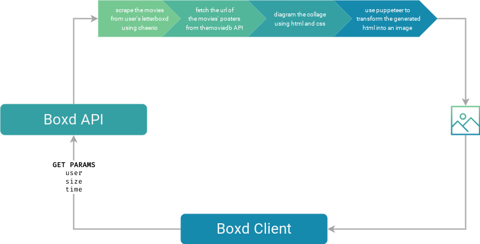

# Boxd Collage Generator
##

> What's the point of watching movies if you can't share about it? Generate 2x2, 3x3, 5x5 collages of the movies that you watched the last months.

---

## What is the Boxd Collage?

The primary idea of Boxd Collage was to build an application that generates a collage of the lastest movies that a user logged in the [Letterboxd](https:letterboxd.com), utilizing [TheMovieDB](https://www.themoviedb.org/) API to fetch the movies' posters. The project is currently in beta.

This project contains some processes that are too complex for a client app only, and not complex enough for a full back end server, and because of this reason, it was decided to use Nextjs and the API Routes.

NextJS is an UI Framework built on top of ReactJS. NextJs provides a feature called API Routes. The API Routes functions as a back end inside the front end, each API Route or endpoint (that is contained inside the `pages/api`) must export a default function that handles the requests made to that endpoint. The Boxd Collage's API Routes are:

- `film_scraper(user:string, time:string):Film` -  film_scraper scrapes the letterboxd home page of the user and collects the movies and return movies watched until `time` months ago. After collecting the movies, a request for each movie title is made to TheMovieDB API to get the poster path of that particular movie. This endpoint returns an array of `Film` objects, which contains the movie name, rating, day of the log and the poster path.
- `generate_collage(user:string,time:string,size:string):dataURI` - Generate collage calls film_scraper to get the Film object, filter the necessary films to the particular `size` of the collage. After that, the collage is built as a HTML Element using HTML and CSS. This HTML Element is opened with `Puppeteer` to use the `screenshot` feature to transform the HTML Element into an PNG. This endpoint returns the DataURI of the collage.

The client is only a simple form to get the user, size and time parameters to call the generate_collage function, as shown here:

This project has a lot of ways to approach and resolve, this one is probably not the most efficient one, but it is cost free, kinda fast to create and attend to the necessity. If something more elaborate comes to mind after that (and I wish to test and build, I'll notify here). The diagram below is a simplified version of the app workflow:

